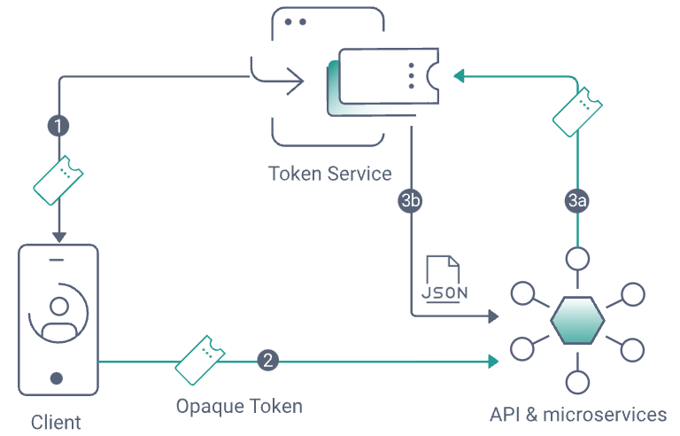

# Phantom Token Plugin for NGINX LUA Systems

[](https://curity.io/resources/code-examples/status/)
[](https://curity.io/resources/code-examples/status/)

A LUA plugin used to introspect opaque access tokens and forward JWT access tokens to APIs.

## The Phantom Token Pattern

The [Phantom Token Pattern](https://curity.io/resources/learn/phantom-token-pattern/) is a privacy preserving pattern in API security.\
It ensures that access tokens returned to internet clients are kept confidential.\
It also externalizes introspection and caching from APIs, to keep the API security code simple.



## Installation

### Kong API Gateway

If you are using luarocks, execute the following command to install the plugin:

```bash
luarocks install kong-phantom-token 2.0.0
```

Or deploy the .lua files into Kong's plugin directory, eg `/usr/local/share/lua/5.1/kong/plugins/phantom-token`.

### OpenResty

If you are using luarocks, execute the following command to install the plugin:

```bash
luarocks install lua-resty-phantom-token 2.0.0
```

Or deploy the `plugin.lua` file to `resty/phantom-token.lua`, where the resty folder is in the `lua_package_path`.

## Required Configuration Directives

All of the settings in this section are required:

#### introspection_endpoint

> **Syntax**: **`introspection_endpoint`** `string`
>
> **Context**: `location`

The URL to the introspection endpoint of the Curity Identity Server.

#### client_id

> **Syntax**: **`client_id`** `string`
>
> **Context**: `location`

The ID of the introspection client configured in the Curity Identity Server.

#### client_secret

> **Syntax**: **`client_secret`** `string`
>
> **Context**: `location`

The string secret of the introspection client configured in the Curity Identity Server.

## Optional Configuration Directives

#### token_cache_seconds

> **Syntax**: **`token_cache_seconds`** `number`
>
> **Context**: `location`
>
> **Default**: 300

The maximum time for which introspected JWTs are cached by the plugin.\
This is overridden if the introspection endpoint returns a `max-age` header with a lower value.\
This header derives from the `access-token-ttl` setting for the client that sent the access token.\
This logic helps to prevent an access token from being cached for longer than its lifetime.

#### scope

> **Syntax**: **`scope`** `string`
>
> **Context**: `location`
>
> **Default**: *`—`*

Can be configured if you want to verify scopes in the gateway.\
To do so, specify the required values(s) for the location as a space separated string, such as `read write`.\
After succesful introspection, if one or more scopes are not present, the plugin will return a 403 error.

#### verify_ssl

> **Syntax**: **`verify_ssl`** `boolean`
>
> **Context**: `location`
>
> **Default**: *true*

A convenience option that should only be used during development.\
This setting can be set to `false` if using untrusted server certificates in the Curity Identity Server.\
Alternatively you can specify trusted CA certificates via the `lua_ssl_trusted_certificate` directive.

## Example Configurations

### Kong API Gateway

For each API route, configure the plugin using configuration similar to the following:

```yaml
- name: myapi
  url: https://api-internal.example.com:3000
  routes:
  - name: myapi-route
    paths:
    - /api
  plugins:
  - name: phantom-token
    config:
      introspection_endpoint: https://login.example.com/oauth/v2/oauth-introspect
      client_id: introspection-client
      client_secret: Password1
      token_cache_seconds: 900
```

When deploying Kong, set an environment variable to activate the plugin in `KONG_PLUGINS`.\
Also define a LUA shared dictionary named `phantom-token` for caching introspection results.\
This  must be provided to Kong via the `KONG_NGINX_HTTP_LUA_SHARED_DICT` environment variable:

```yaml
environment:
  KONG_DATABASE: 'off'
  KONG_DECLARATIVE_CONFIG: '/usr/local/kong/declarative/kong.yml'
  KONG_PROXY_LISTEN: '0.0.0.0:3000'
  KONG_LOG_LEVEL: 'info'
  KONG_PLUGINS: 'bundled,phantom-token'
  KONG_NGINX_HTTP_LUA_SHARED_DICT: 'phantom-token 10m'
```

### OpenResty

If using OpenResty, then first configure the cache for introspection results:

```nginx
http {
    lua_shared_dict phantom-token 10m;
    server {
        ...
    }
}
```

Then apply the plugin to one or more locations with configuration similar to the following:

```nginx
location ~ ^/api {

    rewrite_by_lua_block {

        local config = {
            introspection_endpoint = 'https://login.example.com/oauth/v2/oauth-introspect',
            client_id = 'introspection-client',
            client_secret = 'Password1',
            token_cache_seconds = 900
        }

        local phantomTokenPlugin = require 'resty.phantom-token'
        phantomTokenPlugin.execute(config)
    }

    proxy_pass https://api-internal.example.com:3000;
}
```

### Advanced Configurations

You can apply the plugin to a subset of the API routes, or use the advanced routing features of the reverse proxy.\
The following Kong configuration is for a use case where a route handles both JWTs and opaque tokens.\
This might enable a microservice developer to forward a JWT an upstream microservice behind a gateway.

```yaml
- name: myapi
  url: https://api-internal.example.com:3000
  routes:
  - name: bypass
    paths:
    - /api
    headers:
      authorization: ["~*bearer\\s*[A-Za-z0-9-_]*\.[A-Za-z0-9-_]*\.[A-Za-z0-9-_]*"]

  - name: phantom-token
    paths:
    - /api
    plugins:
    - name: phantom-token
      config:
        introspection_endpoint: https://login.example.com/oauth/v2/oauth-introspect
        client_id: introspection-client
        client_secret: Password1
        token_cache_seconds: 900
```

The equivalent OpenResty configuration is shown in [these tests](/t/advancedRouting.t).

## Deployment

The example [Docker Compose File](/docker/docker-compose.yml) provides OpenResty and Kong deployment examples.

## Development and Testing

The following resources provide further details on how to make code changes to this repo:

- [Kong Phantom Token Tutorial](https://curity.io/resources/learn/integration-kong-open-source/)
- [OpenResty Phantom Token Tutorial](https://curity.io/resources/learn/integration-openresty/)
- [Wiki](https://github.com/curityio/kong-phantom-token-plugin/wiki)

## More Information

Please visit [curity.io](https://curity.io/) for more information about the Curity Identity Server.
